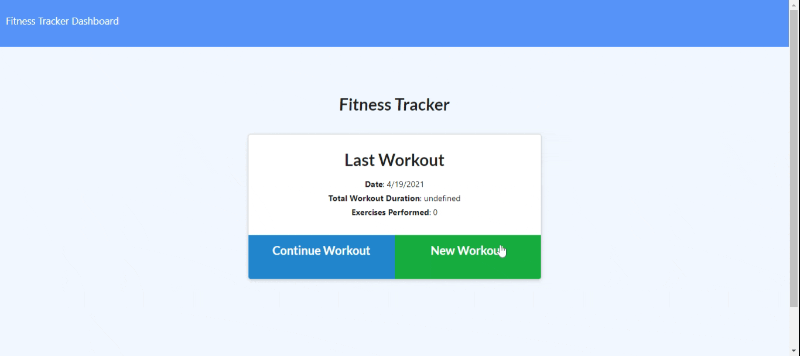

# Git Fit

## Description of Project
Workout tracker for the 21st century! 

This app allows users to view, add, and track exercise and workout information for the week.  You can add both resistance and cardio workout information to keep track of physical wellness goals.  

Read below for further details.  Enjoy!

## Table of Contents

- [Usage](#usage)
- [Credits and Code Used](#credits-and-code-used)
- [Application Demo](#application-demo)
- [Questions](#questions)
- [Takeaways and Future Development](#takeaways-and-future-development)

## Usage
Check out the Heroku-deployed application [here!](https://glacial-wave-65005.herokuapp.com/)

## Credits and Code Used

- JavaScript/ES6
- Node.js
- Mongoose, mongoDB
- express, mongoose npm packages

## Application Demo

## Questions
Check out my GitHub profile [here.](https://github.com/smcmillan28)

Feel free to send me an email, as well: smcmillan1991@gmail.com

## Takeaways and Future Development
Venturing away from SQL and using a different language for structuring database models was definitely a learning experience.  Steps for future development will be centered around perfecting all routes and continuing to debug Heroku application.  
